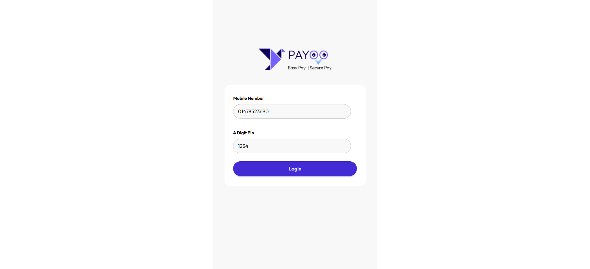
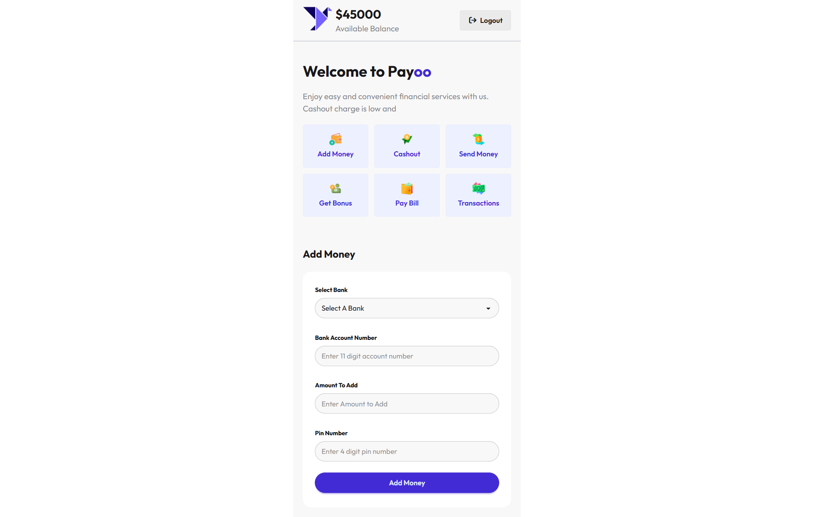

# Payoo

Payoo is a lightweight mobile wallet demo built with static HTML, Tailwind CSS, DaisyUI, and vanilla JavaScript. It includes a login screen, a wallet dashboard, and basic money flow actions such as add money, cashout, and transaction history tracking.

## Live Demo

- Live site: https://shakhaoyat.github.io/payoo/
- Repository: https://github.com/shakhaoyat/payoo

## Screenshots

Demo screenshots are included as PNG files in the repository root.

### Login Page

### Dashboard

## Overview

This project simulates a simple digital wallet experience. Users can log in with a fixed demo account, view the available balance, switch between wallet actions, and see a running transaction history.

## Tech Stack

- HTML5
- Tailwind CSS via CDN
- DaisyUI via CDN
- Vanilla JavaScript
- Google Fonts: Outfit
- Font Awesome icons

## Main Features

- Demo login with fixed mobile number and PIN validation
- Dashboard with available balance display
- Add money form with bank selection, amount input, and PIN validation
- Cashout form with balance deduction and validation
- Transfer money UI and validation scaffold
- Transaction history list for successful money actions
- Mobile-first layout with a simple wallet-style interface

## Dependencies

This project does not use a package manager or local npm dependencies. It relies on the following external CDN resources:

- DaisyUI `https://cdn.jsdelivr.net/npm/daisyui@5`
- Tailwind browser build `https://cdn.jsdelivr.net/npm/@tailwindcss/browser@4`
- Google Fonts `Outfit`
- Font Awesome `7.0.1`

## Local Development

You can run the project locally without any build step.

1. Clone or download the repository.
2. Open the project folder in VS Code or File Explorer.
3. Open `index.html` in a browser to start from the login page.
4. After successful login, the app redirects to `home.html`.

If you prefer a local server, use VS Code Live Server or any static file server.

## Relevant Links

- Login page: [index.html](index.html)
- Home dashboard: [home.html](home.html)
- JavaScript files: [script/login.js](script/login.js), [script/machine.js](script/machine.js), [script/addMoney.js](script/addMoney.js), [script/cashout.js](script/cashout.js), [script/transferMoney.js](script/transferMoney.js)
- Assets: [assets/](assets/)

## Notes

- Demo login credentials are hardcoded in the frontend.
- Transfer money is currently scaffolded in the UI and script layer.
- Tailwind configuration file exists, but the project currently uses the CDN browser build.